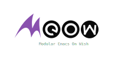

[](https://melpa.org/#/meow)


 
> Less is more

# Highlights

- Semantic but still effective layout on Dvorak, Colemak and Qwerty.
- A complete modal editing plays well with special modes, like dired, etc. Never pay for compatibility.
- Combine __navigation__ and __selection__, rarely use a command to activate selection.
- Use kbd macros when calling underlying commands, drop-in replacement will work out-of-box.
- A `keypad` state allows you execute commands from C-x and C-c keymaps without modifiers.

# Installation

### Melpa

``` emacs-lisp
(use-package meow
  :init
  (meow-global-mode 1)
  :custom
  ;; layout options: qwerty, dvorak, dvp, colemak
  (meow-layout 'qwerty))
```

### use-package with quelpa

``` emacs-lisp
:quelpa (rime :fetcher github
              :repo "DogLooksGood/meow")
```

### use-package with straight

``` emacs-lisp
:straight (rime :type git
                :host github
                :repo "DogLooksGood/meow")
```

# Modal States

### INSERT 

Just vanilla Emacs, the only difference is that you can switch to `NORMAL` state with <kbd>ESC</kbd>.

### NORMAL

Check layout.html in this repo, you can find layout for Qwerty, Dvorak, Colemak and Programmer Dvorak.

Here's an example for Dvorak.


#### Prefix Arguments

Use <kbd>-</kbd>, <kbd>'</kbd> and <kbd>0</kbd> to <kbd>9</kbd>.

#### Toggle States

With <kbd>i</kbd>, <kbd>a</kbd>, <kbd>o</kbd>, <kbd>x</kbd>.

#### Navigation/Selection

The Concept: Meow steals the idea from kakoune, except <kbd>h/t/p/n</kbd>, every navigation command will mark something. And you can enter `INSERT` state at beginning of region with <kbd>i</kbd> or at end of region with <kbd>a</kbd> or use <kbd>r</kbd> to reverse the direction of selection.

NOTE: The keys on Qwerty has some tweaks, check `layout.html`.

Benefits: 

- By one navigation, you get two position, both of them are pretty meaningful. 
- Make it much easier to quick mark something before copy or kill.

__Simple__

Use <kbd>h</kbd> (Head, left), <kbd>t</kbd> (Tail, right), <kbd>p</kbd> (Prev), <kbd>n</kbd> (Next) for single char navigation.

These commands will cancel all selection except those with `char` type, and use with <kbd>Shift</kbd> will activate  selection with `char` type.

__Word__

Use <kbd>m</kbd> (Mark or Back Word) to mark current word with selection type `word-mark`.

When selection type is `word-mark`, <kbd>m</kbd> will move to the previous word.

Use <kbd>w</kbd> (Forward Word) to mark the next word with selection type `word`.

When selection type is `word-mark`, <kbd>w</kbd> will expand selection by word and change selection type to `word-expand`, this type of selection will be cancelled by <kbd>m</kbd>.

__Line__

Use <kbd>l</kbd> (Line) to mark the whole line with selection type `line`.

When selection type is `line`, <kbd>l</kbd> will expand selection by line.

__Block__

Use <kbd>b</kbd> (Block) to expand selection to current block. By default the block is identified with a pair of parentheses. This is useful in Lisp dialects. However languages like python, haskell don't wrap everything with parentheses, so there's a fallback behavior which identify block with indentation.

Press <kbd>b</kbd> multiple times will expand the region. Expanding will stop at top-level form, so hold <kbd>b</kbd> to mark the whole top-level block.

<kbd>b</kbd> will also work in string or comment.

__Exp__

Use <kbd>e</kbd> (Exp) to mark current sexp with selection type `exp`. 

When selection type is `exp`, <kbd>e</kbd> will mark the next one. During the movement, cursor will not escape from the current block, if current sexp is the last sexp in this block, <kbd>e</kbd> will reverse the direction of selection.

__Forwarding__

Use <kbd>f</kbd> (Forwarding) to make a selection from current point(as mark) to the end of current line or end of current block. 

Use negative argument for backwarding.

#### Deletion

Use <kbd>k</kbd> to kill region.

Use <kbd>d</kbd> to delete char.

Use <kbd>j</kbd> to join current line to the previous line.

Use <kbd>z</kbd> to shrink multiple whitespaces into one, then toggle between one spaces and zero spaces.

Use <kbd>x</kbd> to kill region then switch to `INSERT` state.

#### Other commands

<kbd>u</kbd> (Undo) undo the changes, but will only pop to the previous selection when region is active.

### MOTION

Default state for special-mode buffers. There are only two additional bindings in `MOTION` state.

<kbd>SPC</kbd> is used as `LEADER` key, the original command on <kbd>SPC</kbd> is bound to <kbd>SPC SPC</kbd>.

<kbd>ESC</kbd> is used to switch to previous buffer.

### KEYPAD

This is inspired by god-mode. You can activate `KEYPAD` state with <kbd>SPC x</kbd> or <kbd>SPC c</kbd> in `NORMAL` and `MOTION` state.

In this state, every single key is considered with <kbd>Control</kbd>, <kbd>x</kbd> means <kbd>C-x</kbd>; If you want a single <kbd>x</kbd>, use <kbd>SPC x</kbd>; If you want a <kbd>M-x</kbd>, use <kbd>m x</kbd>.

To call a command on <kbd>C-c M-j</kbd>, use <kbd>SPC c m j</kbd>.

To call a command on <kbd>C-c C-x RET</kbd>, use <kbd>SPC c x SPC RET</kbd>. If there's no command on <kbd>C-c C-x C-RET</kbd>, it is okay to omit the second <kbd>SPC</kbd>, just use <kbd>SPC c x RET</kbd>.

# Customize Leader Keymap

Use `meow-leader-define-key` and `meow-leader-define-mode-key` to customize leader keymap.

```emacs-lisp
;; Put these in the :config section in use-package

(meow-leader-define-key
 '("k" . kill-buffer)
 '("l" . goto-line)
 '("h" . other-window)
 '("o" . delete-other-windows)
 '("-" . split-window-below)
 '("/" . swiper)
 '("\\" . split-window-right)
 '("m" . magit-status)
 '("f" . find-file)
 '("F" . find-file-literally))

(meow-leader-define-mode-key
 'emacs-lisp-mode
 '("RET" . eval-buffer)
 '("SPC" . eval-defun))
```

# LICENSE

License under GPL v3.

